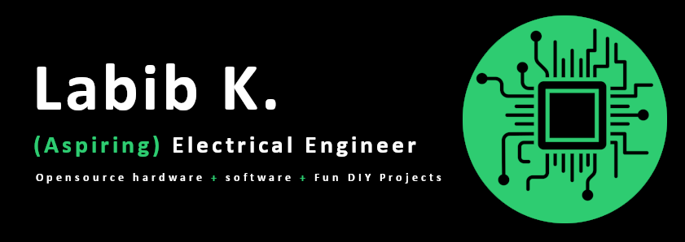

</img>
<h2>Hi there! 👋</h2>
<blockquote>If you follow the most optimal path, the gradient towards the steepest ascent, you're guarenteed to reach a maximum. Whether it's the global maximum is another question; which you won't know unless you find all the other peaks. -- Calculus III 
</blockquote>
 

I'm Labib, a Electrical Engineering student @ University of British Columbia, and I like to build things that are both exciting and useful. I'm an advocate for using opensource software & hardware, as I beleive accessible tech is the best way to drive innovation.

If you're curious, feel free to drop by my website [labibkow.com](https://www.labibkow.com/) for more info! Or peruse through my github repos 😃.

  
<h3>Current Projects</h3>

- RSVP Pocket: An STM32F4 e-reader that utilizes Rapid Serial Visual Presentation technique for speed reading. And as the name suggests, it fits in your pocket!

- ESP32 musicPlayer: Kind of like a mp3 player, but has a 2.4" TFT display and play short video clips. Pretty difficult with a 240 MHz, so this project is mostly about optimizing memory usage and processing time!

- labibkow.com rework: Built on Next.js framework from 2023, and needs a bunch of security and performance updates. Will also add a new landing page.

